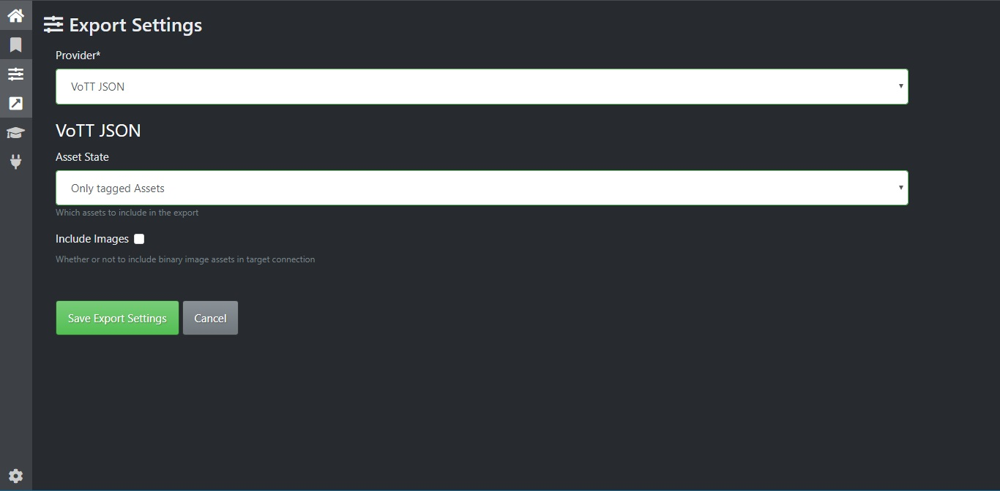

# Mask RCNN
Il seguente repository contiene un'implementazione python della rete neurale Mask-RCNN, utilizzata per effettuare 
instance segmentation su immagini.

Il codice sorgente è scaricabile da github al link https://github.com/matterport/Mask_RCNN.

# Requisiti
- **python 3.6**
- **anaconda3** oppure **miniconda3**

# Installazione
A seguire, le direttive di come installare l'ambiente utilizzando python 3.6 e miniconda3.

Creare un enviromnent conda contenente python 3.6
`conda create -n mask-rcnn python=3.6 --channel conda-forge`

Attivare l'environment appena generato
`conda activate mask-rcnn`

Posizionarsi nella root folder del progetto e installare i pacchetti python richiesti (elencati nel file requirements.txt)
`pip install -r requirements.txt`

# Preparazione del dataset
Per realizzare le annotazioni di ogni immagine del dataset, utilizziamo un tool open-source ad hoc per annotare ed etichettare gli ogetti di un immagine: microsoft VoTT. 

Il software è basato su tecnologia React, per cui è possibile utilizzarlo tramite interfaccia web. Tuttavia quest'ultima non ha accesso al file system del computer, per cui è consigliabile scaricare l'installer, che fornisce una versione desktop del progetto con la possibilità di leggere il dataset dal filesystem. Per informazioni sul suo utilizzo, visitare https://github.com/microsoft/VoTT.

Una volta effettuata la procedura di labelling delle immagini, è possibile esportare le annotazioni in vari formati. Scegliamo come Provider "VoTT JSON". 

Il programma esporterà le annotazioni in formato JSON, generando un file nella sottocartella `vott-json-export`.

Fatto ciò, è necessario effettuare una conversione delle annotazioni del file generato da Microsoft VoTT, in modo da poter estrarre per ogni immagine un file json contenente le anotazione della singola immagine.

`python utils/convert_annots.py -i <input_folder> -o <output_folder>`

Dove <input_folder> è il path alla folder di annotazioni JSON e <output_folder> è il path alla folder in cui lo script salverà le annotazioni delle singole immagini nel formato JSON previsto da Mask-RCNN.

**NOTA**

Per la conversione delle annotazioni dell'intera immagine o della singola componente seguire le istruzioni contenute nello script

# Augmentation
Sono state implementate alcune tecniche di data augmentation che permettono di manipolare le immagini del dataset e di creare immagini sintetiche.

`python utils/data_augmentation.py -i <image_folder> -a <annotation_folder>`

`python utils/data_generation.py -i <image_component_folder> -a <annotation_component_folder>`

**Nota** 

Prima di effettuare l'augmentation eseguire lo script per il mascheramento delle immagini .PNG dei componenti.
Verificare che il path in cui sono salvate le immagini sia quello presente nello script e nel caso modificarlo.

`python utils/component_definition.py`

# Auto-labeling
Per velocizzare il processo di etichettatura del dataset è stato utilizzato un algoritmo di image processing SIFT
mediante il quale è possibile ricavare la matrice Omografica a partire da due immagini che rappresentano lo stesso oggetto 
ma da diverse angolazioni.
Poichè il dataset per il training del modello Mask-RCNN è ottenuto da immagini di un pannello ottenute da diverse angolazioni,
è possibile utilizzare lo script `image_sift.py` per etichettare tutte le immagini a partire da un immagine etichettata 
come riferimento.

`python utils/component_definition.py
-a <path_to_annotation>/annots/ 
-i <path_to_dataset>/images/ 
-w <path_to_warp_dir>/warp_images/`

# Reasoner
Nella directory `reasoner` sono presenti le cartelle:

- **encoding**: contenente le regole del programma logico
- **graph**: immagine del risultato del confronto tra i grafi del CAD Reasoner e della rete neurale
- **cad**: contenente il file di fatti e le posizioni relative in output dal CAD Reasoner
- **net**: contenente i fatti e le posizioni relative in output dal modulo di Instance Segmentation
- **dlv2**: eseguibile del programma dlv2

# Graph Comparator
Per la compliance dei grafi utilizzare il programma logico *encoding.asp*

`   ./reasoner/dlv2 
    reasoner/net/<file_net.asp> 
    reasoner/cad/<file_cad.asp>  
    reasoner/encoding/encoding.asp 
    --filter=posRelNet/5,posRelCad/5,compNonPresente/2,compInEccesso/2,noRelCad/4,noRelNet/4
    > reasoner/graph/<file_compliance.asp>`

E' stato implementato un algoritmo di comparazione dei grafi.

`python utils/graph_comparator.py`

# Training
Per effettuare il training del dataset elettrocablaggi

`python samples/elettrocablaggi/train.py`

# Prediction
Per effettuare la previsione su una nuova immagine relativa al dataset elettrocablaggi

`python samples/elettrocablaggi/predict.py`

**Nota:** inserire il file di annotazione in formato .JSON nella apposita folder 
- DEVE essere presente il campo NOME dell'immagine
- NON è necessario l'annotazione delle componenti
- NON è necessario il path corretto dell'immagine

